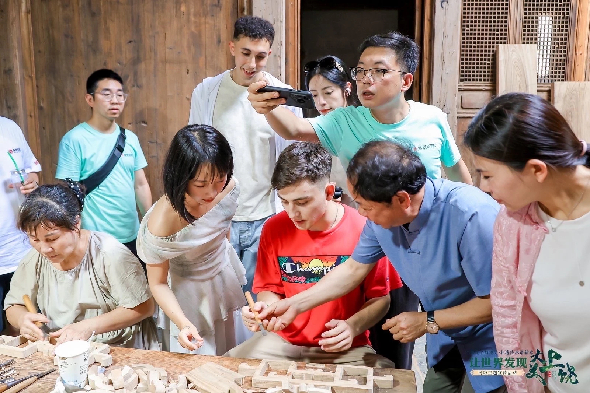

# 个人在线简历 | Portfolio
✨ 英语能力 | 内容创作 | 口译实践 | 自媒体作品

---

## 👩‍💻 基本信息
- 学历：硕士
- 方向：英语教学 / 国际合作 / 内容创作 / 口译
- 技能：英语专业八级、高级口译、中英互译、视频创作、自媒体运营

---

## 📝 专栏文章
- 文章方向：英语学习、学习方法、个人成长
- 特点：逻辑清晰、可读性强、适合新媒体传播
> 可后续陆续添加文章链接

---

## 🎬 自媒体作品
- 平台：小红书 / 抖音 / B站（你改成自己的）
- 代表作品：**千赞爆款视频**
- 方向：英语学习 / 知识分享 / vlog
- 能力体现：文案策划、拍摄剪辑、内容表达

---

## 🗣️ 口译与实践项目
- 参与展会口译、商务交流、外事活动
- 擅长：中英交替传译、现场沟通、专业术语表达
- 可提供项目照片展示（后续上传）

---

## 📄 证书与能力
- 英语专业八级
- 上海高级口译证书
- 熟练中英互译、文稿润色
- 自媒体内容创作、视频脚本

---

## 📩 联系方式
- GitHub：当前页面
- 邮箱：__________（你填自己的）
